<h1 align="center">🖥️ Proyecto: Trailerflix</h1>
 
&nbsp;

<h3 align="center">💻 Éste es nuestro 3er proyecto: Trailerflix</h3>

&nbsp;

<h3 id="introduccion" align="center">📜 Introducción</h3>

<p>💻 Este proyecto es una aplicación web de catálogo de computadoras. Permite realizar operaciones CRUD (Crear, Leer, Actualizar y Eliminar) sobre los elementos del catálogo, utilizando JavaScript, Node.js y Express.js , y Sequelize , para poder comunicarnos con una base de datos creada y diseñada en MySQL.</p>
<p>🛠️ Es un proyecto con un esfuerzo colaborativo donde cada miembro del equipo contribuyó con su experiencia y conocimientos. Trabajamos en distintas ramas, realizamos reuniones para resolver problemas en conjunto, compartir ideas y métodos de codificación, y al final, unimos todo el trabajo para completar el proyecto exitosamente.</p>

&nbsp;

<h2 id="tabla-de-contenidos" align="center">🔗 Tabla de Contenidos</h2>

- [Introducción](#introduccion)
- [Diseño de Modelo de Base de Datos](#diseño-datos)
- [Tabla de Endpoints](#tabla-de-endpoints)
- [Requisitos](#requisitos)
- [Instrucciones para Ejecutar el Código](#instrucciones-para-ejecutar-el-codigo)
- [Contribución](#contribucion)
- [Tecnologías utilizadas](#tecnologias-utilizadas)
- [Herramientas utilizadas](#herramientas-utilizadas)
- [Explicación y algunos ejemplos de uso](#screenshots-endpoints)

&nbsp;

<p>👩‍💻 Hecho en grupo, por las alumnas:</p>

`GitHub profiles ↓`

<ul>
        <li><a href="https://github.com/amarantaVC" target="_blank">Amaranta Villegas</a></li>
        <li><a href="https://github.com/dxniela" target="_blank">Daniela Ramírez</a></li>
        <li><a href="https://github.com/Roci16" target="_blank">Rocio Ibañez</a></li>
        <li><a href="https://github.com/silfigue" target="_blank">Silvina Figueroa</a></li>
</ul>

---

&nbsp;

<h2 id="diseño-datos" align="center"> Diseño del Modelo de Datos </h2>
Se diseñó un modelo de datos para una plataforma de streaming basado en la información del archivo JSON.
Para realizar el diseño efectivo de la base de datos y sus tablas se utilizó la plataforma DB Designer (https://www.dbdesigner.net/).

<h3 align="center"> Diagrama de entidad-relación resultante: </h3>


## &nbsp;

&nbsp;

<h2 id="tabla-de-endpoints" align="center">🔗 Tabla de Endpoints </h2>
<h3 align="center">Endpoints Contenido</h3>

| Método | Endpoint                   | Descripción                                                                     | Parámetros                | Cuerpo de la Solicitud                                                                                                                                                                                                                       |
| ------ | -------------------------- | ------------------------------------------------------------------------------- | ------------------------- | -------------------------------------------------------------------------------------------------------------------------------------------------------------------------------------------------------------------------------------------- |
| GET    | `/api/contenido`           | Devuelve una lista con todos los datos disponibles en el catálogo.              | N/A                       | N/A                                                                                                                                                                                                                                          |
| GET    | `/api/contenido/peliculas` | Devuelve una lista con todas las peliculas disponibles en el catálogo.          | N/A                       | N/A                                                                                                                                                                                                                                          |
| GET    | `/api/contenido/series`    | Devuelve una lista con todas las series disponibles en el catálogo.             | N/A                       | N/A                                                                                                                                                                                                                                          |
| GET    | `/api/contenido/id/:id`    | Devuelve un elemento específico según el código proporcionado.                  | `codigo` (en la URL)      | N/A                                                                                                                                                                                                                                          |
| GET    | `/api/contenido/buscar`    | Filtrar por el título de una película o serie proporcionados.                   | /contenido?titulo=:titulo | N/A                                                                                                                                                                                                                                          |
| POST   | `/api/contenido`           | Agrega un nuevo dato al catálogo.                                               | N/A                       | <pre>{<br>"title": string,<br>"poster": string,<br>"resumen": string,<br>"temporadas": number<br>, <br>"trailer": string<br>, <br>"categorias": string<br><br>"genero": string<br>, <br>"tags": string<br>, <br>"reparto": string<br>}</pre> |
| PUT    | `/api/contenido`           | Actualiza los detalles de un elemento específico según el código proporcionado. | `codigo` (en la URL)      | <pre>{<br>"title": string,<br>"poster": string,<br>"resumen": string,<br>"temporadas": number<br>, <br>"trailer": string<br>, <br>"categorias": string<br><br>"genero": string<br>, <br>"tags": string<br>, <br>"reparto": string<br>}</pre> |
| DELETE | `/api/contenido`           | Elimina un elemento específico del catálogo según el código proporcionado.      | `codigo` (en la URL)      | N/A                                                                                                                                                                                                                                          |

&nbsp;

<h3 align="center">Endpoints Tags</h3>

| Método | Endpoint        | Descripción                                                                     | Parámetros           | Cuerpo de la Solicitud                                     |
| ------ | --------------- | ------------------------------------------------------------------------------- | -------------------- | ---------------------------------------------------------- |
| GET    | `/api/tags`     | Devuelve una lista con todos los Tags                                           | -                    | N/A                                                        |
| POST   | `/api/tags`     | Agrega un nuevo dato al catálogo.                                               | N/A                  | <pre>{<br>"codigo": number,<br>"nombre": string<br>}</pre> |
| PUT    | `/api/tags/:id` | Actualiza los detalles de un elemento específico según el código proporcionado. | `codigo` (en la URL) | <pre>{<br>"nombre": string<br>}</pre>                      |
| DELETE | `/api/tags/:id` | Elimina un elemento específico del catálogo según el código proporcionado.      | `codigo` (en la URL) | N/A                                                        |

&nbsp;

<h3 align="center">Endpoints Genero</h3>

| Método | Endpoint                       | Descripción                                                                     | Parámetros                               | Cuerpo de la Solicitud                |
| ------ | ------------------------------ | ------------------------------------------------------------------------------- | ---------------------------------------- | ------------------------------------- |
| GET    | `/api/genero`                  | Devuelve una lista con todos los datos disponibles en el catálogo.              | N/A                                      | N/A                                   |
| GET    | `/api/genero/serie/:genero`    | Devuelve todas las series de un genero en especifico.                           | `codigo` (en la URL)                     | N/A                                   |
| GET    | `/api/genero/pelicula/:genero` | Devuelve todas las peliculas de un genero en especifico                         | `compuName`, `compuCategory` (en la URL) | N/A                                   |
| POST   | `/api/genero`                  | Agrega un nuevo dato al catálogo.                                               | N/A                                      | <pre>{<br>"nombre": string<br>}</pre> |
| PUT    | `/api/genero/:id`              | Actualiza los detalles de un elemento específico según el código proporcionado. | `codigo` (en la URL)                     | <pre>{<br>"nombre": string<br>}</pre> |
| DELETE | `/api/genero/:id`              | Elimina un elemento específico del catálogo según el código proporcionado.      | `codigo` (en la URL)                     | N/A                                   |

&nbsp;

<h3 align="center">Endpoints Actores</h3>

| Método | Endpoint                             | Descripción                                                                     | Parámetros           | Cuerpo de la Solicitud                |
| ------ | ------------------------------------ | ------------------------------------------------------------------------------- | -------------------- | ------------------------------------- |
| GET    | `/api/actores`                       | Devuelve una lista con todos los actores disponibles en el catálogo.            | N/A                  | N/A                                   |
| GET    | `/api/actores/actores?actor=:nombre` | Devuelve el primer Actor que coinciden con el nombre proporcionados.            | `nombre` (en la URL) | N/A                                   |
| POST   | `/api/actores`                       | Agrega un nuevo dato al catálogo.                                               | N/A                  | <pre>{<br>"nombre": string<br>}</pre> |
| PUT    | `/api/actores/:id`                   | Actualiza los detalles de un elemento específico según el código proporcionado. | `codigo` (en la URL) | <pre>{<br>"precio": number<br>}</pre> |
| DELETE | `/api/actores/:id`                   | Elimina un elemento específico del catálogo según el código proporcionado.      | `codigo` (en la URL) | N/A                                   |

&nbsp;

<h3 align="center">Endpoints Categorias</h3>

| Método | Endpoint              | Descripción                                                                     | Parámetros           | Cuerpo de la Solicitud                |
| ------ | --------------------- | ------------------------------------------------------------------------------- | -------------------- | ------------------------------------- |
| GET    | `/api/categoria`      | Devuelve una lista con todos los datos disponibles en el catálogo.              | N/A                  | N/A                                   |
| POST   | `/api/categoria`      | Agrega un nuevo dato al catálogo.                                               | N/A                  | <pre>{<br>"nombre": string<br>}</pre> |
| PUT    | `/api/categoriao/:id` | Actualiza los detalles de un elemento específico según el código proporcionado. | `codigo` (en la URL) | <pre>{<br>"nombre": string<br>}</pre> |
| DELETE | `/api/categoria/:id`  | Elimina un elemento específico del catálogo según el código proporcionado.      | `codigo` (en la URL) | N/A                                   |

&nbsp;

---

&nbsp;

<h2 id="requisitos" align="center">💻  Requisitos</h2>

- Node.js y npm instalados.
- MySQL en funcionamiento con la base de datos configurada.

&nbsp;

<h2 id="instrucciones-para-ejecutar-el-codigo" align="center">📄 Instrucciones para Ejecutar el Código</h2>
<ol>
    <li>Clonar el repositorio</li>
    <li>Instalar dependencias:
        <pre><code>npm install</code></pre>
    </li>
       <li>Ejecutar en la DB: <br>
       Para crear las tablas de la base de datos, abrir MySQL y ejecutar el script `createBD` que se encuentra en la carpeta  <pre><code>/src/scripts</code></pre>
       </li>
      <li> Luego ejecutar el script `insertDB` para cargar los datos en la base creada que usaremos para las consultas.
    </li>
    <li>Configurar el archivo .env (se puede guiar del .env.example):
        <pre><code>DB_HOST="localhost"
DB_USER="root" // Tu usuario de MySQL
DB_PASS="" // Tu password de MySQL
DB_NAME="trailerflix" // Nombre de la base de datos
DB_PORT="3306"
DB_DIALECT="mysql"
PORT=3000 </code></pre>
    </li>
    <li>Ejecutar la aplicación:
        <pre><code>npm start</code></pre>
    </li>
</ol>

<h2 id="contribucion" align="center">🤝 Contribución</h2>
<p>¡Las contribuciones son bienvenidas! Si deseas contribuir, por favor sigue estos pasos:<p>
<ol>
        <li>Haz un fork del proyecto.</li>
        <li>Crea una rama nueva 
                <pre><code>git checkout -b feature/tu-feature</code></pre>
        </li>
        <li>Realiza tus cambios.</li>
        <li>Haz un commit de tus cambios
                 <pre><code>git commit -m 'Agrega nueva característica'</code></pre>
        </li>
        <li>Haz push a la rama 
         <pre><code>git push origin feature/tu-feature</code></pre>
        </li>
        <li>Abre un Pull Request.</li>
    </li>
</ol>
&nbsp;

---

&nbsp;

<h2 id="tecnologias-utilizadas" align="center">🛠 Tecnologías utilizadas</h2>

&nbsp;

<p align="center"> 
<a href="https://www.mysql.com/" target="_blank" style="margin: 0 10px;">
  
</a>

  <a href="https://nodejs.org/" target="_blank" style="margin: 0 10px;"> 
     
  </a>
  <a href="https://expressjs.com/" target="_blank" style="margin: 0 10px;"> 
     
  </a>
  <a href="https://git-scm.com/" target="_blank" style="margin: 0 10px;"> 
     
  </a> 
</p>

&nbsp;

<h2 id="herramientas-utilizadas" align="center">🧰 Herramientas utilizadas</h2>

&nbsp;

<p align="center"> 
  <a href="https://code.visualstudio.com/" target="_blank" style="margin: 0 10px;"> 
     
  </a>
  <a href="https://trello.com/" target="_blank" style="margin: 0 10px;"> 
     
  </a>
  <a href="https://www.dbdesigner.net/" target="_blank" style="margin: 0 10px;">
  
</a>
</p>

&nbsp;

<h2 id="screenshots-endpoints" align="center">📷 Explicación y algunos ejemplos de uso</h2>

&nbsp;

### 1. Obtener la información de todas las películas y series

- **Método**: `GET`
- **Ruta**: `/api/contenido/`
- **Descripción**: Obtiene toda la informacion de todas las pelis y series

**Ejemplo de solicitud**:

```
http://localhost:3000/api/contenido
```
<p align="center"> 
    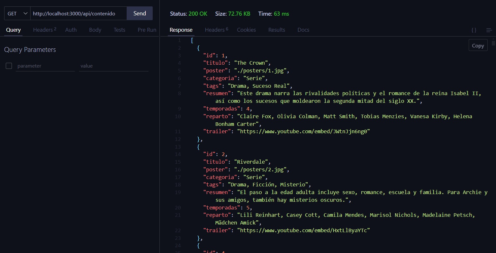
</p>


### 2. Obtener peliculas o series por titulo

- **Método**: `GET`
- **Ruta**: `/api/contenido/buscar`
- **Descripción**: Obtiene una pelicula o series segun un titulo dado

**Ejemplo de solicitud**:

```
http://localhost:3000/api/contenido/buscar?titulo=The Mandalorian
```
<p align="center"> 
    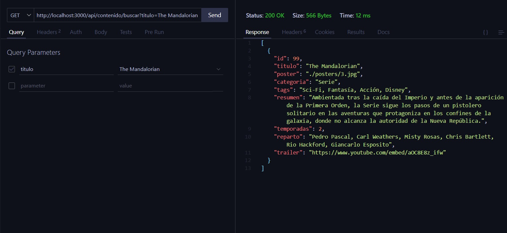
</p>


### 3. Eliminar una pelicula o serie especifica

- **Método**: `DELETE`
- **Ruta**: `/api/contenido/:id`
- **Descripción**: Elimina una pelicula o serie especifica segun un id dado

**Ejemplo de solicitud**:

```
http://localhost:3000/api/contenido/8
```
<p align="center"> 
    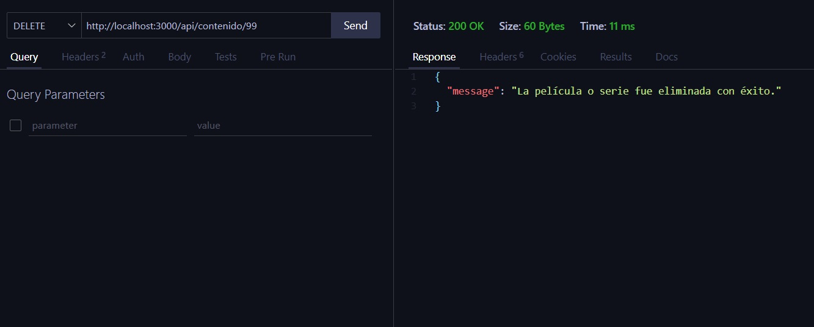
</p>


### 4. Crear una pelicula o serie 

- **Método**: `POST`
- **Ruta**: `/api/contenido`
- **Descripción**: Crea una pelicula o serie 

**Ejemplo de solicitud**:

```
http://localhost:3000/api/contenido
```
<p align="center"> 
    
</p>


### 5. Actualizar una pelicula o serie específica

- **Método**: `PUT`
- **Ruta**: `/api/contenido/:id`
- **Descripción**: Actualiza una pelicula o serie específica según su id dado

**Ejemplo de solicitud**:

```
http://localhost:3000/api/contenido/100
```
<p align="center"> 
    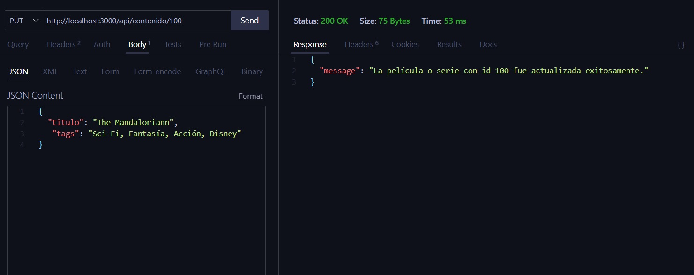
</p>

Se puede observar que se actualizó correctamente al hacer la solicitud por el id de la serie actualizada:

<p align="center"> 
    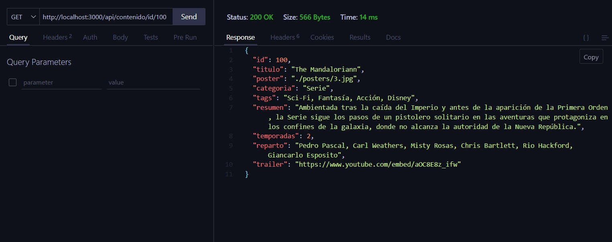
</p>


### 6. Obtener todos los actores

- **Método**: `GET`
- **Ruta**: `/api/actores`
- **Descripción**: Obtener todos los actores

**Ejemplo de solicitud**:

```
http://localhost:3000/api/actores
```
<p align="center"> 
    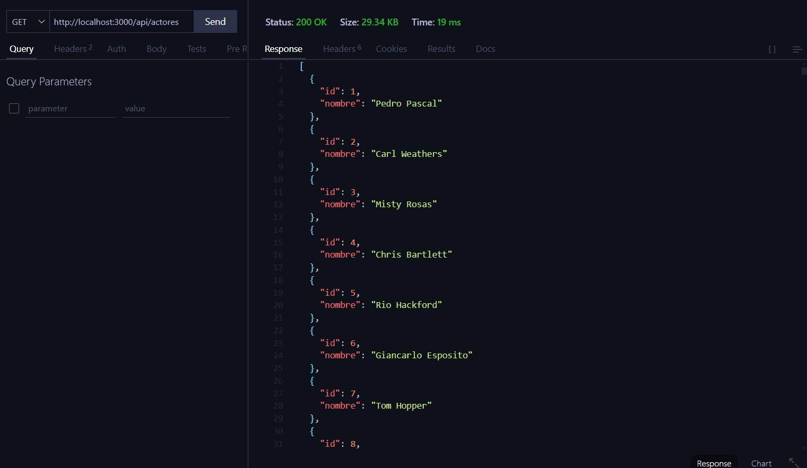
</p>


### 7. Obtener un actor por su id

- **Método**: `GET`
- **Ruta**: `/api/actores/:id`
- **Descripción**: Obtener un actor específico dado su id

**Ejemplo de solicitud**:

```
http://localhost:3000/api/actores/10
```
<p align="center"> 
    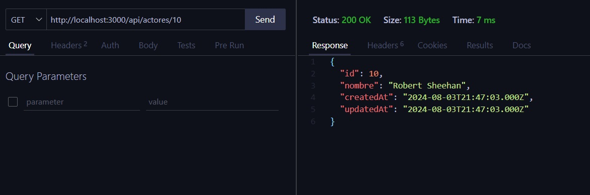
</p>


### 8. Crear un actor

- **Método**: `POST`
- **Ruta**: `/api/actores`
- **Descripción**: Crear un nuevo actor o actriz en la base de datos.

**Ejemplo de solicitud**:

```
http://localhost:3000/api/actores
```
<p align="center"> 
    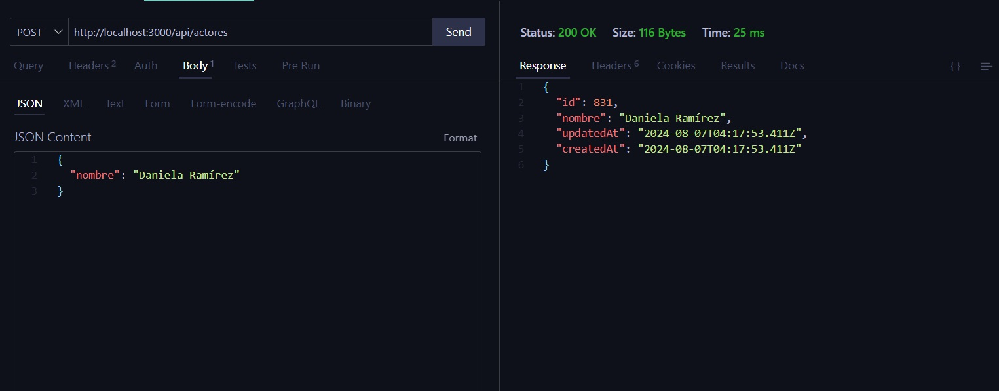
</p>


### 9. Actualizar un actor

- **Método**: `PUT`
- **Ruta**: `/api/actores/:id`
- **Descripción**: Actualiza la info de un actor o actriz dado su id.

**Ejemplo de solicitud**:

```
http://localhost:3000/api/actores/831
```
<p align="center"> 
    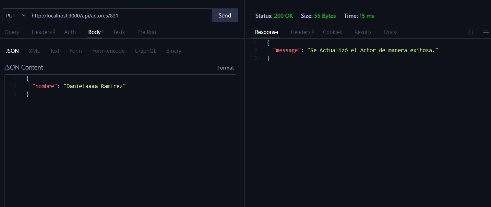
</p>


### 10. Eliminar un actor

- **Método**: `DELETE`
- **Ruta**: `/api/actores/:id`
- **Descripción**: Eliminar un actor o actriz dado su id.

**Ejemplo de solicitud**:

```
http://localhost:3000/api/actores/831
```
<p align="center"> 
    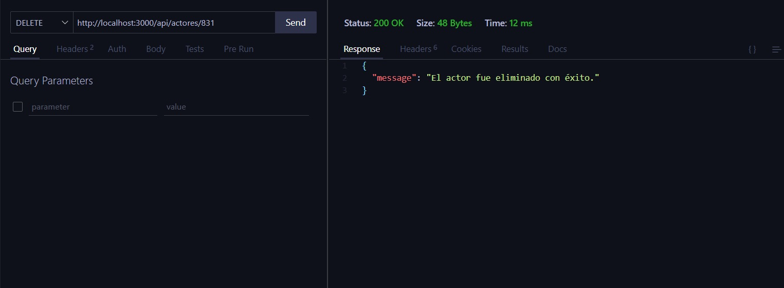
</p>


### 11. Obtener todas las categorías

- **Método**: `GET`
- **Ruta**: `/api/categoria`
- **Descripción**: Se obtiene todas las categorías existentes.

**Ejemplo de solicitud**:

```
http://localhost:3000/api/categoria
```
<p align="center"> 
    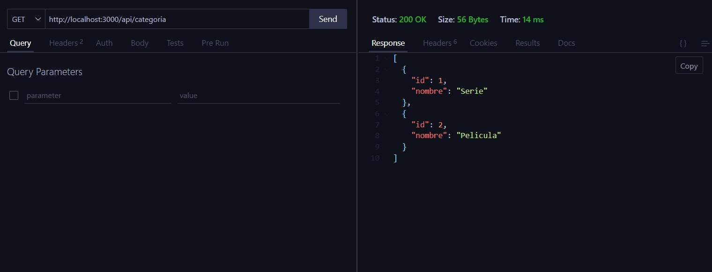
</p>


### 12. Crear una categoría

- **Método**: `POST`
- **Ruta**: `/api/categoria`
- **Descripción**: Crea una nueva categoría

**Ejemplo de solicitud**:

```
http://localhost:3000/api/categoria
```
<p align="center"> 
    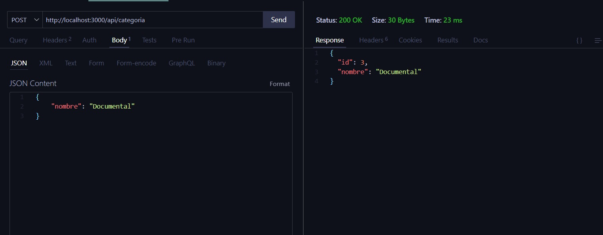
</p>


### 13. Actualizar una categoría

- **Método**: `PUT`
- **Ruta**: `/api/categoria/:id`
- **Descripción**: Actualiza una categoría dado su id

**Ejemplo de solicitud**:

```
http://localhost:3000/api/categoria/3
```
<p align="center"> 
    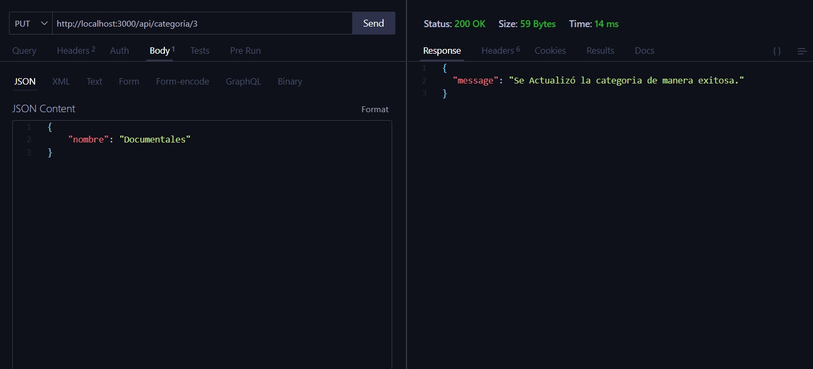
</p>


### 14. Eliminar una categoría

- **Método**: `DELETE`
- **Ruta**: `/api/categoria/:id`
- **Descripción**: Elimina una categoría dado su id

**Ejemplo de solicitud**:

```
http://localhost:3000/api/categoria/3
```
<p align="center"> 
    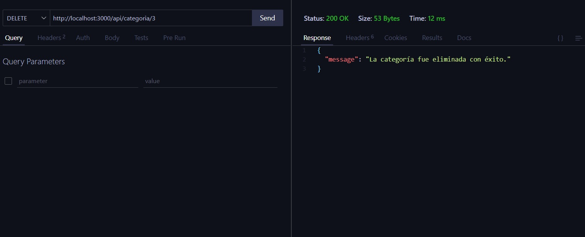
</p>


### 15. Obtener todos los géneros

- **Método**: `GET`
- **Ruta**: `/api/genero`
- **Descripción**: Se obtiene todos los generos existentes.

**Ejemplo de solicitud**:

```
http://localhost:3000/api/genero
```
<p align="center"> 
    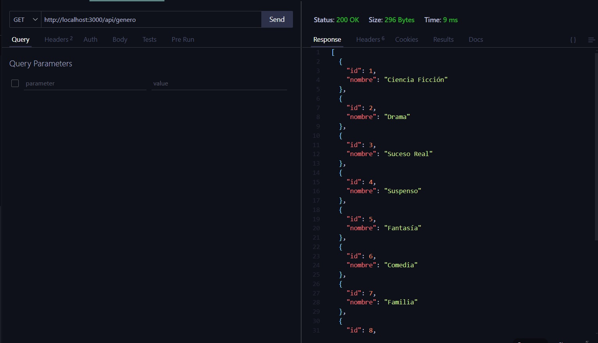
</p>


### 16. Obtener todas las peliculas de un género

- **Método**: `GET`
- **Ruta**: `api/genero/pelicula/:genero`
- **Descripción**: Se obtienen todas las películas de un genero específico.

**Ejemplo de solicitud**:

```
http://localhost:3000/api/genero/pelicula/suspenso
```
<p align="center"> 
    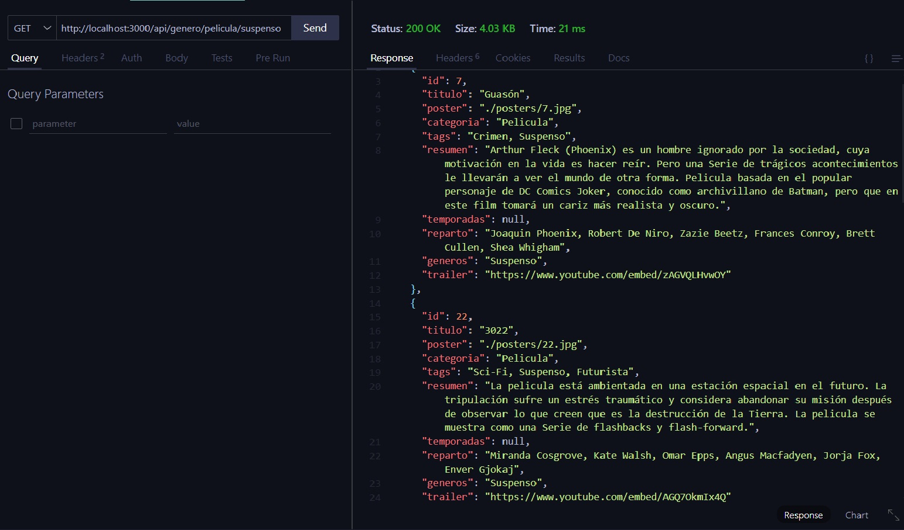
</p>


### 17. Crear un género

- **Método**: `POST`
- **Ruta**: `/api/genero`
- **Descripción**: Crea un nuevo género

**Ejemplo de solicitud**:

```
http://localhost:3000/api/genero
```
<p align="center"> 
    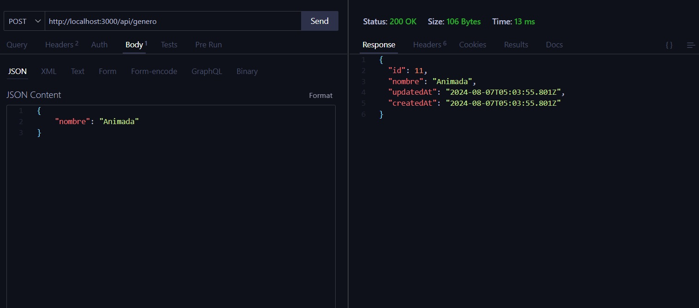
</p>


### 18. Actualizar un género

- **Método**: `PUT`
- **Ruta**: `/api/genero/:id`
- **Descripción**: Actualiza un genero dado su id

**Ejemplo de solicitud**:

```
http://localhost:3000/api/genero/11
```
<p align="center"> 
    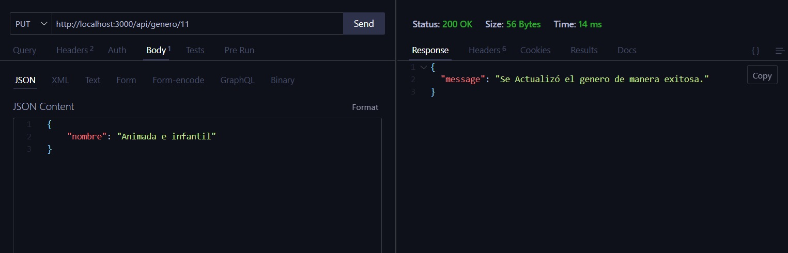
</p>


### 19. Eliminar un género

- **Método**: `DELETE`
- **Ruta**: `/api/genero/:id`
- **Descripción**: Elimina un género dado su id

**Ejemplo de solicitud**:

```
http://localhost:3000/api/genero/11
```
<p align="center"> 
    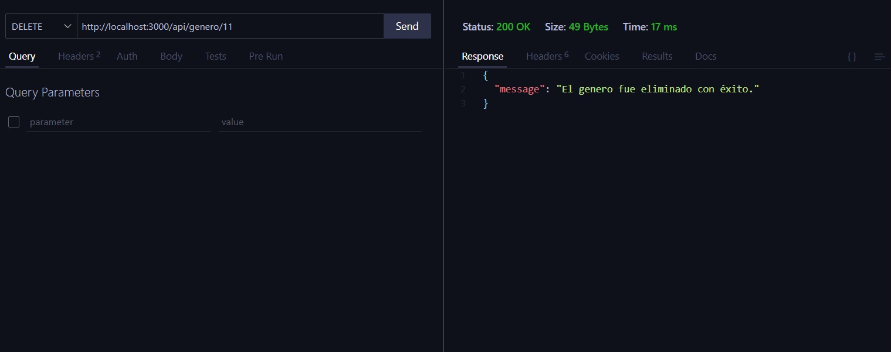
</p>


### 20. Obtener todos los tags

- **Método**: `GET`
- **Ruta**: `/api/tags`
- **Descripción**: Se obtiene todos los tags existentes.

**Ejemplo de solicitud**:

```
http://localhost:3000/api/tags
```
<p align="center"> 
    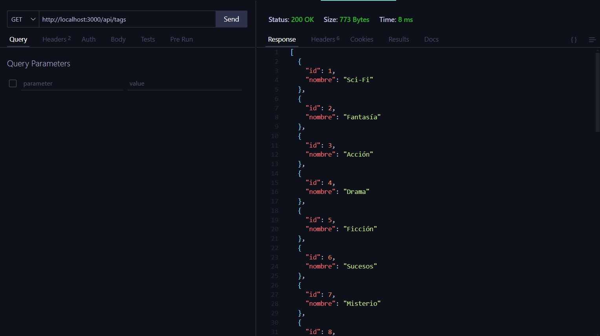
</p>


### 21. Crear un tag

- **Método**: `POST`
- **Ruta**: `/api/tags`
- **Descripción**: Crea un nuevo tag

**Ejemplo de solicitud**:

```
http://localhost:3000/api/tags
```
<p align="center"> 
    
</p>


### 22. Actualizar un tag

- **Método**: `PUT`
- **Ruta**: `/api/tags/:id`
- **Descripción**: Actualiza un tag dado su id

**Ejemplo de solicitud**:

```
http://localhost:3000/api/tags/27
```
<p align="center"> 
    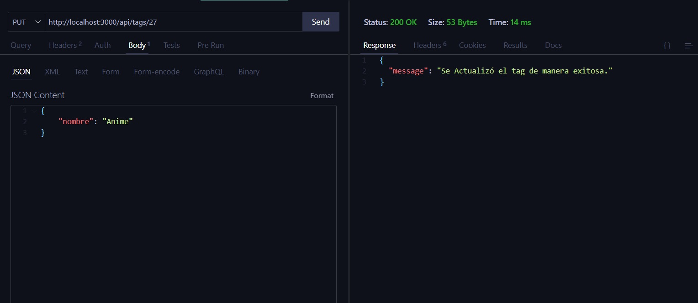
</p>


### 23. Eliminar un tag

- **Método**: `DELETE`
- **Ruta**: `/api/tags/:id`
- **Descripción**: Elimina un tag dado su id

**Ejemplo de solicitud**:

```
http://localhost:3000/api/tags/27
```
<p align="center"> 
    
</p>
