# Trabajo Final Ingenias Backend  - Grupo 4

Proyecto final que consiste en la creación de un servidor back utilizando JavaScript, Node.js y Express.js , y Sequelize , para poder comunicarnos con una base de datos creada y diseñada en MySQL.

<p>👩‍💻 Hecho en grupo, por las alumnas:</p>

`GitHub profiles ↓`
<ul>
        <li><a href="https://github.com/amarantaVC" target="_blank">Amaranta Villegas</a></li>
        <li><a href="https://github.com/dxniela" target="_blank">Daniela Ramírez</a></li>
        <li><a href="https://github.com/Roci16" target="_blank">Rocio Ibañez</a></li>
        <li><a href="https://github.com/silfigue" target="_blank">Silvina Figueroa</a></li>
</ul>

## Diseño del Modelo de Datos
Se diseñó un modelo de datos para una plataforma de streaming basado en la información del archivo JSON.
Para realizar el diseño efectivo de la base de datos y sus tablas se utilizó la plataforma DB Designer. 

https://www.dbdesigner.net/
## Diagrama de entidad-relación resultante:


## Tecnologías Utilizadas

- **JavaScript**: Lenguaje de programación utilizado.
- **Node.js**: Entorno de ejecución para JavaScript en el servidor.
- **Express**: Framework web para Node.js.
- **Sequelize**: ORM para Node.js para interacción con bases de datos MySQL.
- **dotenv**: Para gestionar variables de entorno.
- **MySQL**: Sistema de gestión de bases de datos SQL.


## Requisitos

- Node.js y npm instalados.
- MySQL en funcionamiento con la base de datos configurada.
- Dependencias instaladas con `npm install`.

## Instrucciones de Instalación

- Descargar o clonar el repositorio en su equipo.
    ```bash
    git clone git@github.com:dxniela/FinalJump-Entrega3-Grupo04.git
    ```

- Navega al directorio del proyecto hasta la carpeta Grupo-4 e instala las dependencias requeridas
   ```bash
    cd Grupo-4
    npm install
    ```

- Abrir MySQL y ejecutar el script `createBD` que se encuentra en la carpeta `scripts` para crear las *tablas* de la base de datos. Luego ejecutar el script `insertDB` para cargar los datos en la base creada que usaremos para las consultas.


- Configura el archivo .ENV (se puede guiar del .env.example)
```
DB_HOST="localhost" 
DB_USER="root"
DB_PASS="" Agrega tu password de MySQL
DB_NAME="trailerflix" 
DB_PORT="3306"
DB_DIALECT="mysql"
PORT=3000 

```
- Usar el comando `npm start` para iniciar el servidor.

    ```bash
    npm start
    ```

# Endpoints
|Método| Endpoint |Descripción|
|------|----------|-----------|
| GET  |"/api/contenido"|Obtener la información de todas las películas y series|
| GET  |"/api/contenido/id/:id"| Obtener toda la info de una peli o serie por su id|
| GET  |"/api/contenido/buscar"| Obtener peliculas o series por titulo|
| GET  |"/api/contenido/peliculas"| Obtener todas las películas|
| GET  |"/api/contenido/series"| Obtener todas las series|
| POST  |"/api/contenido"| Crear una nueva película o serie|
|PUT|"/api/contenido/:id"| Actualizar una pelicula o serie especifica|
|DELETE|"/api/contenido/:id"| Eliminar una pelicula o serie especifica|
| GET  |"/api/actores"|Obtener todos los actores|
| GET  |"/api/actores/:id"|Obtener la información de un actor por su id|
| POST  |"/api/actores"|Crea un nuevo actor|
| PUT  |"/api/actores/:id"|Actualiza un actor por su id|
| DELETE  |"/api/actores/:id"|Elimina un actor por su id|
| GET  |"/api/categoria"|Obtener todas las categorias|
| POST  |"/api/categoria"|Crea una categoría|
|PUT|"/api/categoria/:id"|Actualizar una categoría |
|DELETE|"/api/categoria/:id"|Elimina una categoría |
|GET |"/api/genero"| Obtener todos los generos |
|GET|"/api/genero/pelicula/:genero"| Obtener todas las peliculas de un genero en especifico|
|GET|"/api/genero/serie/:genero"|Obtener todas las series de un genero en especifico|
|POST |"/api/genero"| Crea un genero |
|PUT |"/api/genero/:id"| Actualiza un genero por su id |
|DELETE|"/api/genero/:id"| Elimina un genero por su id |
|GET|"/api/tags"| Obtener todos los tags|
|POST|"/api/tags"| Crear un nuevo tag|
|PUT|"/api/tags/:id"| Actualiza un tag|
|DELETE|"/api/tags/:id"| Elimina un tag|

## Explicación y algunos ejemplos de uso:

## 1. Obtener la información de todas las películas y series

- **Método**: `GET`
- **Ruta**: `/api/contenido/`
- **Descripción**: Obtiene toda la informacion de todas las pelis y series

**Ejemplo de solicitud**:

```
http://localhost:3000/api/contenido
```
<p align="center"> 
    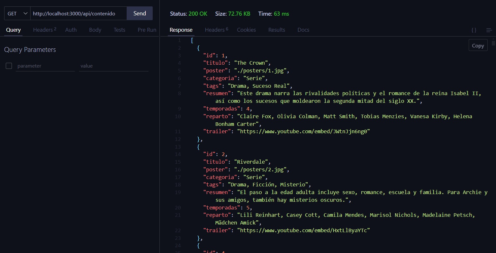
</p>


## 2. Obtener peliculas o series por titulo

- **Método**: `GET`
- **Ruta**: `/api/contenido/buscar`
- **Descripción**: Obtiene una pelicula o series segun un titulo dado

**Ejemplo de solicitud**:

```
http://localhost:3000/api/contenido/buscar?titulo=The Mandalorian
```
<p align="center"> 
    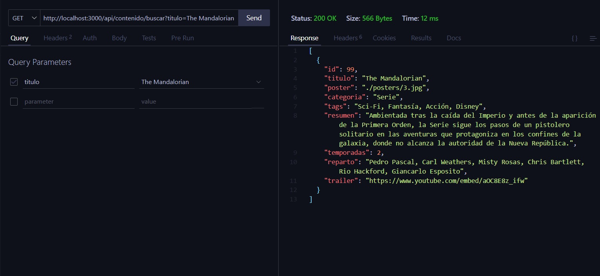
</p>


## 3. Eliminar una pelicula o serie especifica

- **Método**: `DELETE`
- **Ruta**: `/api/contenido/:id`
- **Descripción**: Elimina una pelicula o serie especifica segun un id dado

**Ejemplo de solicitud**:

```
http://localhost:3000/api/contenido/8
```
<p align="center"> 
    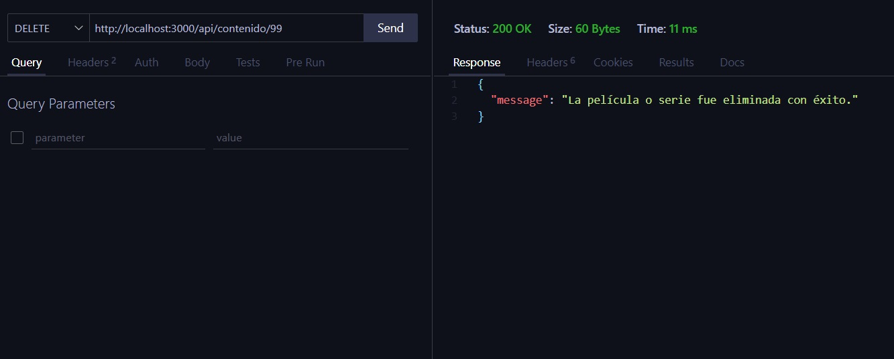
</p>


## 4. Crear una pelicula o serie 

- **Método**: `POST`
- **Ruta**: `/api/contenido`
- **Descripción**: Crea una pelicula o serie 

**Ejemplo de solicitud**:

```
http://localhost:3000/api/contenido
```
<p align="center"> 
    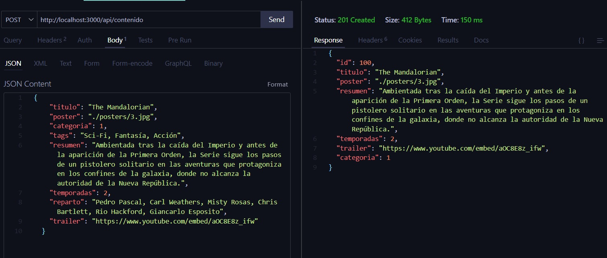
</p>


## 5. Actualizar una pelicula o serie específica

- **Método**: `PUT`
- **Ruta**: `/api/contenido/:id`
- **Descripción**: Actualiza una pelicula o serie específica según su id dado

**Ejemplo de solicitud**:

```
http://localhost:3000/api/contenido/100
```
<p align="center"> 
    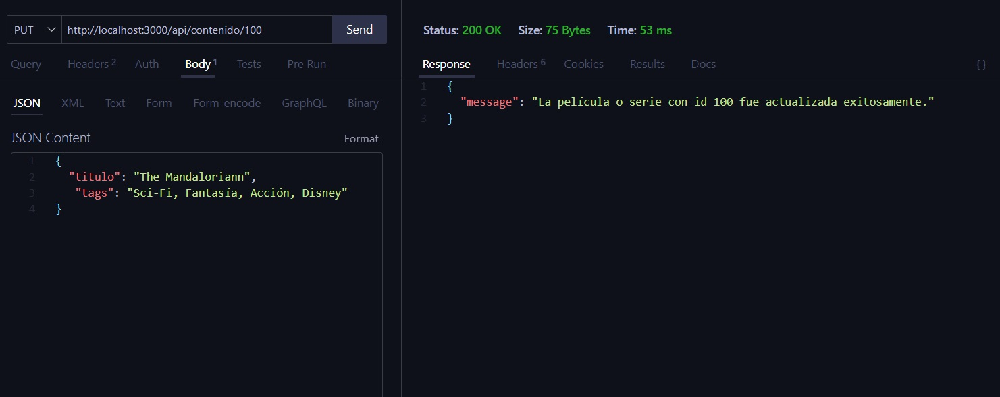
</p>

Se puede observar que se actualizó correctamente al hacer la solicitud por el id de la serie actualizada:

<p align="center"> 
    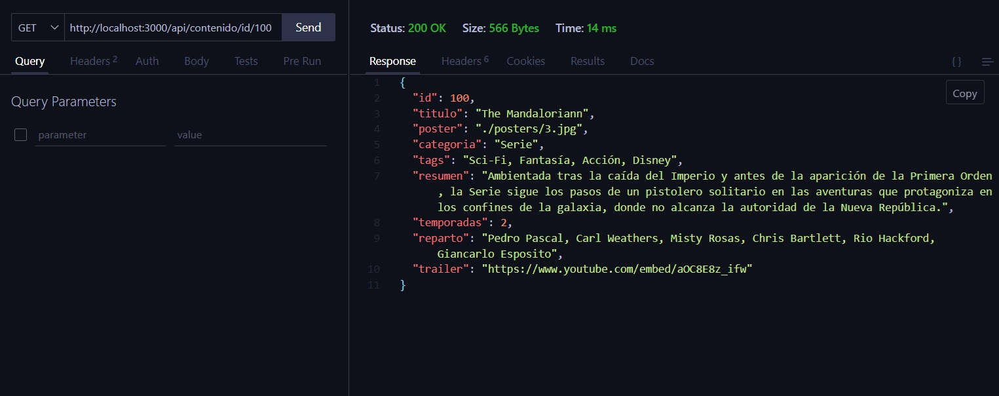
</p>


## 6. Obtener todos los actores

- **Método**: `GET`
- **Ruta**: `/api/actores`
- **Descripción**: Obtener todos los actores

**Ejemplo de solicitud**:

```
http://localhost:3000/api/actores
```
<p align="center"> 
    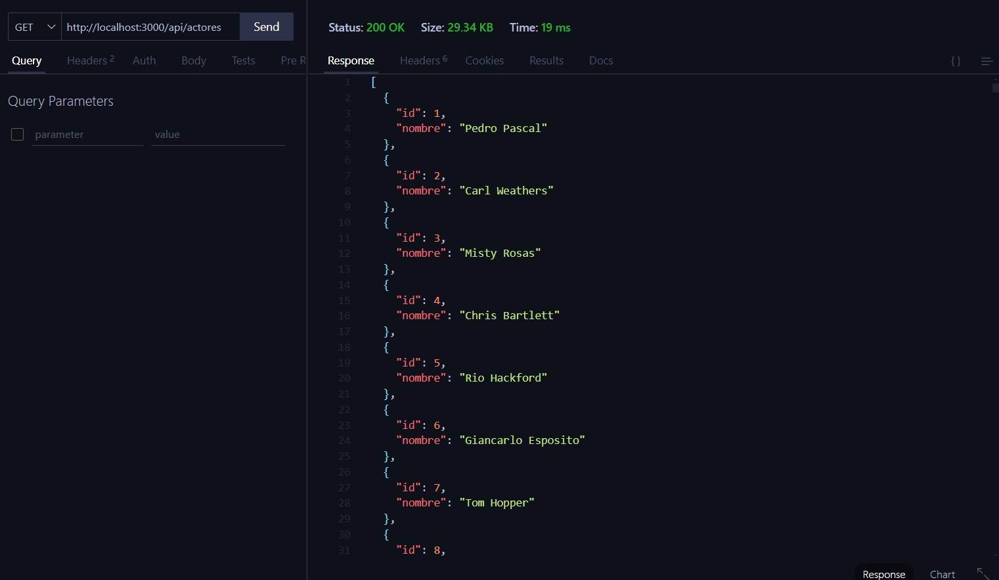
</p>


## 7. Obtener un actor por su id

- **Método**: `GET`
- **Ruta**: `/api/actores/:id`
- **Descripción**: Obtener un actor específico dado su id

**Ejemplo de solicitud**:

```
http://localhost:3000/api/actores/10
```
<p align="center"> 
    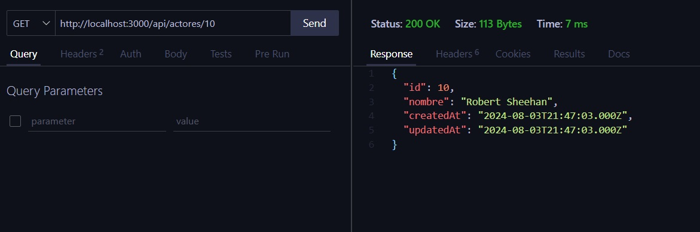
</p>


## 8. Crear un actor

- **Método**: `POST`
- **Ruta**: `/api/actores`
- **Descripción**: Crear un nuevo actor o actriz en la base de datos.

**Ejemplo de solicitud**:

```
http://localhost:3000/api/actores
```
<p align="center"> 
    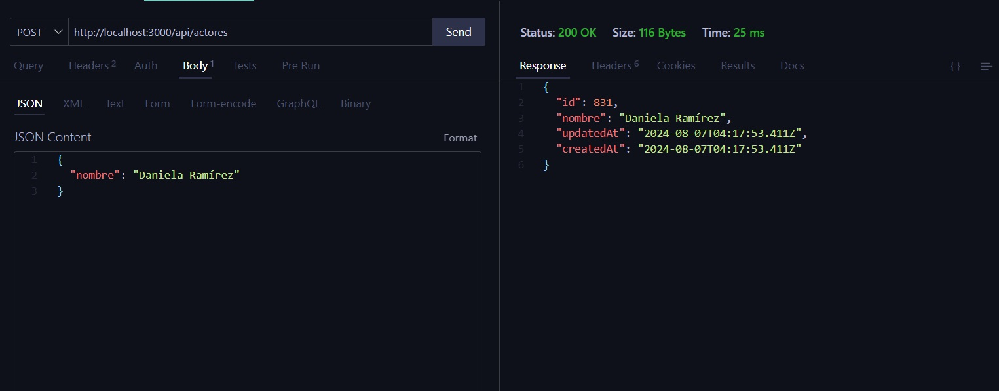
</p>


## 9. Actualizar un actor

- **Método**: `PUT`
- **Ruta**: `/api/actores/:id`
- **Descripción**: Actualiza la info de un actor o actriz dado su id.

**Ejemplo de solicitud**:

```
http://localhost:3000/api/actores/831
```
<p align="center"> 
    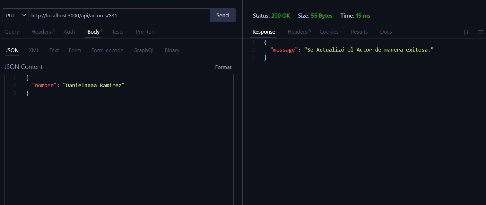
</p>


## 10. Eliminar un actor

- **Método**: `DELETE`
- **Ruta**: `/api/actores/:id`
- **Descripción**: Eliminar un actor o actriz dado su id.

**Ejemplo de solicitud**:

```
http://localhost:3000/api/actores/831
```
<p align="center"> 
    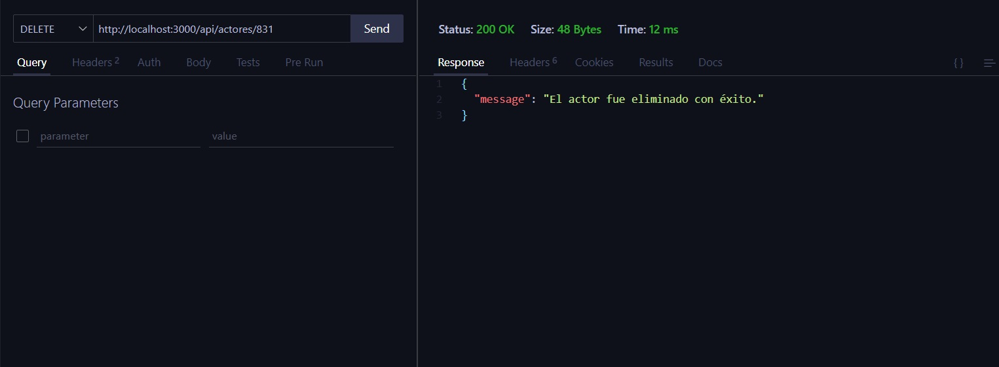
</p>


## 11. Obtener todas las categorías

- **Método**: `GET`
- **Ruta**: `/api/categoria`
- **Descripción**: Se obtiene todas las categorías existentes.

**Ejemplo de solicitud**:

```
http://localhost:3000/api/categoria
```
<p align="center"> 
    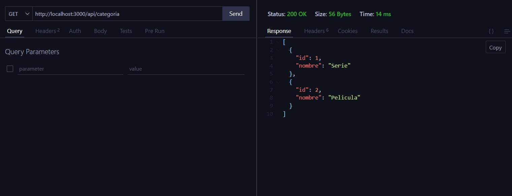
</p>


## 12. Crear una categoría

- **Método**: `POST`
- **Ruta**: `/api/categoria`
- **Descripción**: Crea una nueva categoría

**Ejemplo de solicitud**:

```
http://localhost:3000/api/categoria
```
<p align="center"> 
    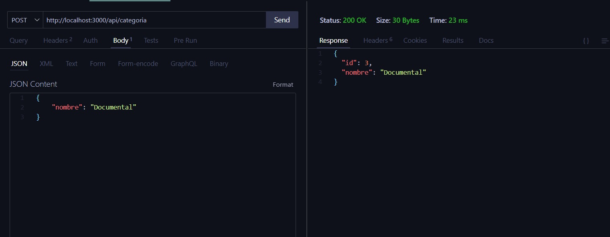
</p>


## 13. Actualizar una categoría

- **Método**: `PUT`
- **Ruta**: `/api/categoria/:id`
- **Descripción**: Actualiza una categoría dado su id

**Ejemplo de solicitud**:

```
http://localhost:3000/api/categoria/3
```
<p align="center"> 
    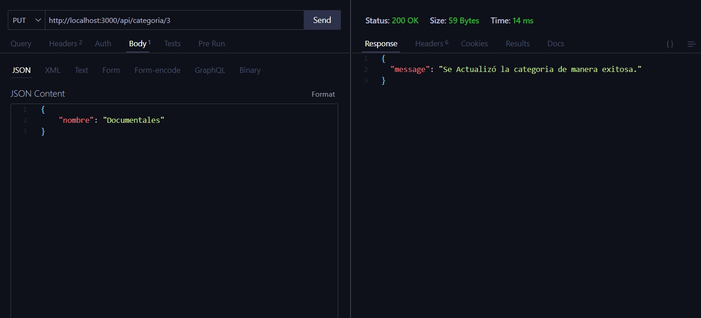
</p>


## 14. Eliminar una categoría

- **Método**: `DELETE`
- **Ruta**: `/api/categoria/:id`
- **Descripción**: Elimina una categoría dado su id

**Ejemplo de solicitud**:

```
http://localhost:3000/api/categoria/3
```
<p align="center"> 
    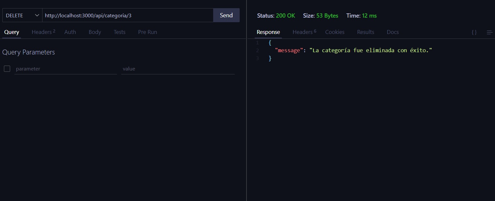
</p>


## 15. Obtener todos los géneros

- **Método**: `GET`
- **Ruta**: `/api/genero`
- **Descripción**: Se obtiene todos los generos existentes.

**Ejemplo de solicitud**:

```
http://localhost:3000/api/genero
```
<p align="center"> 
    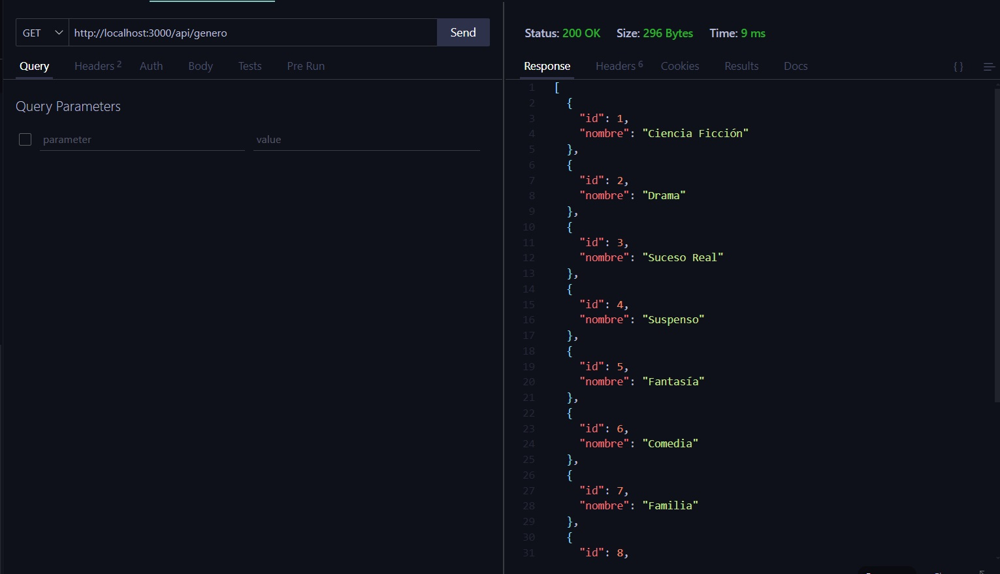
</p>


## 16. Obtener todas las peliculas de un género

- **Método**: `GET`
- **Ruta**: `api/genero/pelicula/:genero`
- **Descripción**: Se obtienen todas las películas de un genero específico.

**Ejemplo de solicitud**:

```
http://localhost:3000/api/genero/pelicula/suspenso
```
<p align="center"> 
    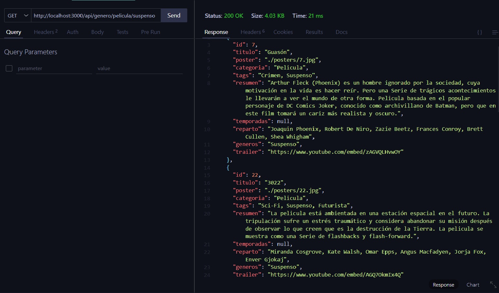
</p>


## 17. Crear un género

- **Método**: `POST`
- **Ruta**: `/api/genero`
- **Descripción**: Crea un nuevo género

**Ejemplo de solicitud**:

```
http://localhost:3000/api/genero
```
<p align="center"> 
    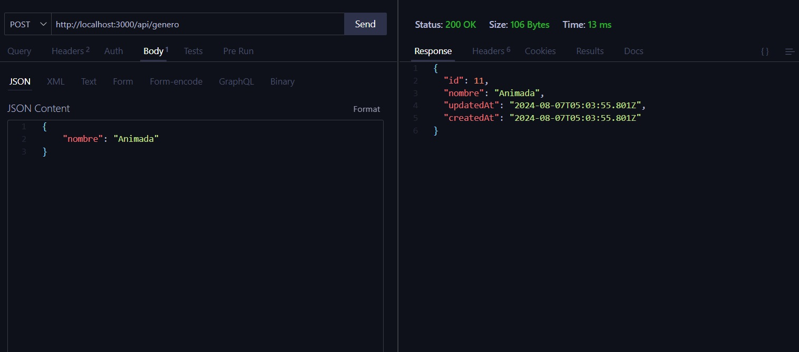
</p>


## 18. Actualizar un género

- **Método**: `PUT`
- **Ruta**: `/api/genero/:id`
- **Descripción**: Actualiza un genero dado su id

**Ejemplo de solicitud**:

```
http://localhost:3000/api/genero/11
```
<p align="center"> 
    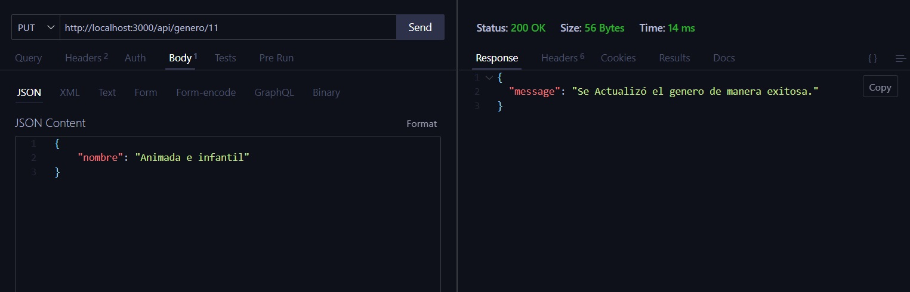
</p>


## 19. Eliminar un género

- **Método**: `DELETE`
- **Ruta**: `/api/genero/:id`
- **Descripción**: Elimina un género dado su id

**Ejemplo de solicitud**:

```
http://localhost:3000/api/genero/11
```
<p align="center"> 
    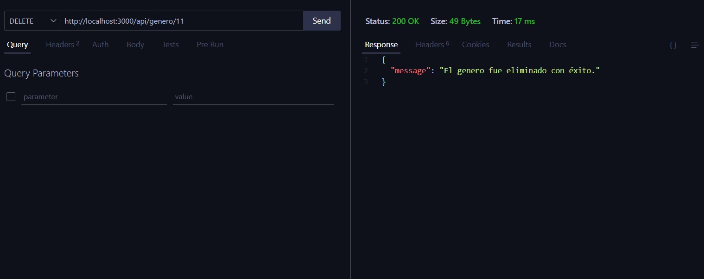
</p>


## 20. Obtener todos los tags

- **Método**: `GET`
- **Ruta**: `/api/tags`
- **Descripción**: Se obtiene todos los tags existentes.

**Ejemplo de solicitud**:

```
http://localhost:3000/api/tags
```
<p align="center"> 
    
</p>


## 21. Crear un tag

- **Método**: `POST`
- **Ruta**: `/api/tags`
- **Descripción**: Crea un nuevo tag

**Ejemplo de solicitud**:

```
http://localhost:3000/api/tags
```
<p align="center"> 
    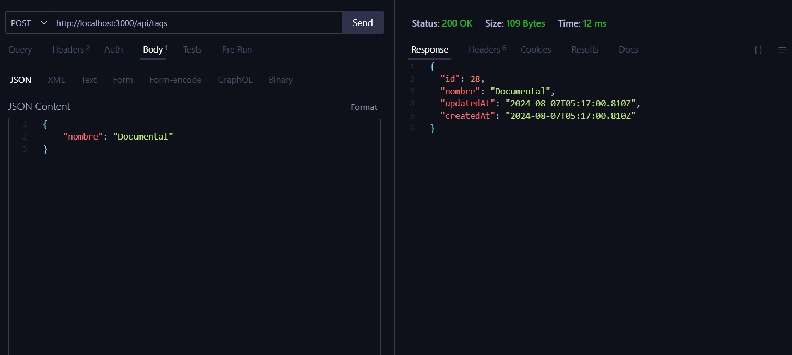
</p>


## 22. Actualizar un tag

- **Método**: `PUT`
- **Ruta**: `/api/tags/:id`
- **Descripción**: Actualiza un tag dado su id

**Ejemplo de solicitud**:

```
http://localhost:3000/api/tags/27
```
<p align="center"> 
    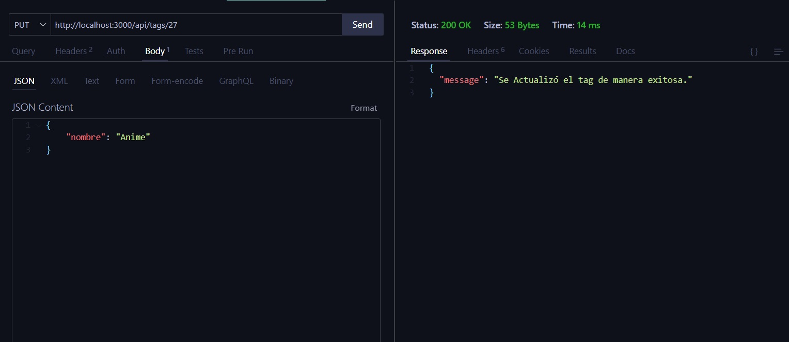
</p>


## 23. Eliminar un tag

- **Método**: `DELETE`
- **Ruta**: `/api/tags/:id`
- **Descripción**: Elimina un tag dado su id

**Ejemplo de solicitud**:

```
http://localhost:3000/api/tags/27
```
<p align="center"> 
    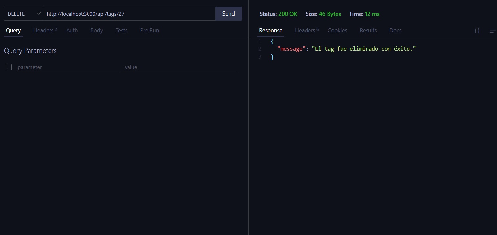
</p>